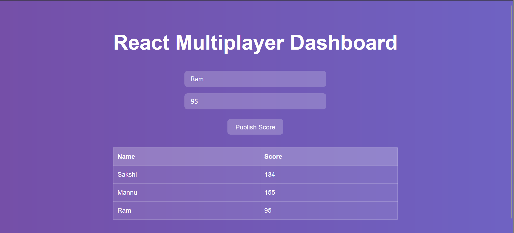

# 🎮 React Multiplayer Dashboard (WebSocket-based)

A simple **real-time multiplayer score dashboard** built using **React** and **Socket.IO**.  
Players can enter their names and scores, and all updates are broadcasted instantly to everyone connected — no page refresh required!

This project was created as a part of learning **WebSockets** and **real-time communication** in web development, following [this tutorial video](https://www.youtube.com/watch?v=CzcfeL7ymbU&t=2619s) and inspired by [Nishant’s repository](https://github.com/nishant-666/Multiplayer-dashboard-using-websockets/).

---

## 🚀 Features

- 🌐 Real-time data update using **Socket.IO**
- 👥 Multiple users can connect simultaneously
- 🧮 Add player names and scores dynamically
- ⚡ Auto-refresh scoreboard across all clients
- 🎨 Simple and responsive UI with gradient background

---

## 🧠 Tech Stack

**Frontend:**
- React.js  
- HTML, CSS  
- Socket.IO Client  

**Backend:**
- Node.js  
- Express.js  
- Socket.IO Server  

---

## ⚙️ Installation and Setup

### 1. Clone this repository
```bash
git clone https://github.com/your-username/react-multiplayer-dashboard.git
cd react-multiplayer-dashboard
```
### 2. Install dependencies
You’ll have two folders: one for the client and one for the server.
👉 For the client:
```bash
cd client
npm install
```
👉 For the server:
```bash
cd ../server
npm install
```
### 3. Run the application
Start the backend server
```bash
npm start
```
The backend runs on http://localhost:3000
Start the React frontend
```bash
cd ../client
npm run dev
```
The frontend runs on http://localhost:5173

## 📂 Folder Structure
```
multi-player-game/
├── client/
│ ├── src/
│ │ ├── App.jsx
│ │ ├── App.css
│ │ └── components/
│ │ └── Input.jsx
│ └── package.json
├── server/
│ ├── server.js
│ └── package.json
├── .gitignore
└── README.md
```
## 🖼️ Preview

Add player names and scores, hit **Publish**, and see all connected users’ dashboards update in real time.



## 🧠 Learning Goal

This project was created to:

- Understand how **WebSockets** enable real-time two-way communication between client and server.
- Learn how **Socket.IO** integrates with React and Node.js.
- Practice building a simple but functional **multiplayer dashboard**.
- Gain hands-on experience with **frontend-backend communication** and dynamic UI updates.

---
Made with ❤️ by Saumya Bhardwaj

